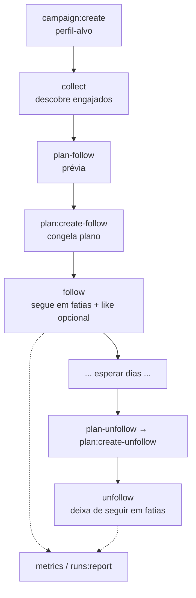

# automation-seguidores

Assistente **local** e **supervisionado** para campanhas de crescimento no
Instagram, focado em **engajamento real**: a partir de um perfil-alvo do seu
nicho, ele descobre quem **comentou** nas publicações recentes desse perfil,
segue essas pessoas de forma controlada, opcionalmente **curte** uma publicação
delas, e depois permite **deixar de seguir** em lote por período/campanha —
sempre com histórico local, auditoria e **parada fechada** (na dúvida, não age).

> ⚠️ **Não é um robô autônomo.** Toda ação real exige modo explícito, plano
> congelado, **limite positivo** e confirmação. O modo padrão é `dry-run` e o
> limite real padrão é **zero**. O navegador é **visível** e o login é **manual**
> (nenhuma credencial é preenchida ou armazenada). Veja [AGENTS.md](./AGENTS.md).

---

## Índice

- [automation-seguidores](#automation-seguidores)
  - [Índice](#índice)
  - [Objetivo](#objetivo)
  - [Como funciona](#como-funciona)
  - [Funcionalidades](#funcionalidades)
  - [Requisitos](#requisitos)
  - [Instalação](#instalação)
  - [Conceitos essenciais](#conceitos-essenciais)
  - [Uso — fluxo completo](#uso--fluxo-completo)
  - [Exemplo end-to-end](#exemplo-end-to-end)
  - [Comandos](#comandos)
  - [Métricas e relatórios](#métricas-e-relatórios)
  - [Onde ficam os dados](#onde-ficam-os-dados)
  - [Segurança e limites](#segurança-e-limites)
  - [Desenvolvimento](#desenvolvimento)
  - [Documentação](#documentação)
  - [Aviso legal](#aviso-legal)

---

## Objetivo

Automatizar, **com supervisão humana**, o ciclo de prospecção por afinidade:

1. Escolher um **perfil-alvo** do nicho (ex.: um grande perfil do mercado financeiro).
2. **Coletar** as pessoas que engajam com esse perfil (comentaristas das publicações recentes).
3. **Seguir** essas pessoas em lotes controlados para atrair atenção.
4. **Curtir** uma publicação recente delas (opcional) para aumentar a chance de retorno.
5. Depois de um tempo, **deixar de seguir** quem foi seguido pela ferramenta.

O produto foi desenhado para ser **auditável e reversível**: cada ação vira um
registro no banco local, com evidência (screenshot), e nada é feito sem sua
confirmação.

## Como funciona



Cada plano é um **snapshot imutável** (`DRAFT → FROZEN`). A execução é
**idempotente**: itens já confirmados são pulados; qualquer resultado ambíguo ou
falha **para o lote** para revisão manual. Um follow ambíguo pode ser pulado por
decisão explícita com `follow:skip-ambiguous`; depois, reexecutar o mesmo plano
continua de onde parou (não há retomada automática).

## Funcionalidades

- **Coleta engajada** — descobre comentaristas das publicações recentes do alvo
  (com rolagem dos comentários e teto configurável por post); dedup por username;
  prioriza engajamento.
- **Follow supervisionado** — 4 modos: `dry-run`, `manual`, `confirm-each`,
  `supervised-batch`. Distingue perfil **aberto** (vira follow) de **fechado**
  (vira solicitação).
- **Curtida** — `like-post` (curte 1 publicação recente por candidato/campanha)
  ou `follow --like` (curte já ao seguir, só perfis abertos, na mesma passada).
- **Unfollow por coorte** — por período (`--older-than`, `--from/--to`,
  `--calendar-month`), por campanha, ou tudo que a ferramenta seguiu.
- **Filtro de qualidade** — `--skip-inactive N` pula perfis com menos de N
  seguidores **e** menos de N seguindo (contas vazias/bot).
- **Progresso em tempo real** — uma linha por item no lote (`[12/100] @fulano — confirmado ✓`).
- **Segurança de falha fechada** — para em CAPTCHA, desafio, aviso, sessão
  expirada, troca de conta, interface desconhecida ou divergência.
- **Auditoria e evidência** — cada tentativa é registrada (runs + `action_attempts`),
  com screenshot em sucesso, ambiguidade e falha.
- **Métricas e relatórios** — `metrics` (por estado e por campanha) e `runs:report`.
- **Proteções** — só ciclos iniciados pela ferramenta (`TOOL_CLICK`) entram no
  unfollow; whitelist e perfis protegidos nunca são removidos.

## Requisitos

- **Node.js 20+** (testado no Node 24) e **npm**.
- Windows, macOS ou Linux.
- Uma conta do Instagram **sua ou autorizada**.

## Instalação

```bash
npm ci                         # instala as dependências exatas do package-lock
npx playwright install chromium   # baixa o navegador controlado pela ferramenta
npm run dev -- db:migrate      # cria o banco local
```

Para configurar em outra máquina, veja
[TUTORIAL_INSTALACAO.md](./TUTORIAL_INSTALACAO.md) (copiar o projeto **sem**
`node_modules/` e `dist/`).

## Conceitos essenciais

- **Padrão seguro:** por padrão nada acontece de verdade — modo `dry-run` e limite
  real **zero**. É preciso um modo real **e** um `--limit` positivo para agir.
- **Navegador visível + login manual:** a ferramenta abre um Chrome visível; você
  faz login; nenhuma senha é preenchida ou guardada.
- **Sequencial:** as ações rodam uma a uma (nunca em paralelo), de propósito.
- **Modos de execução** (follow e unfollow):

  | Modo | O que faz |
  |---|---|
  | `dry-run` | Só lista o que **seria** feito. Nenhuma ação. (padrão) |
  | `manual` | Abre cada perfil e **espera você agir**. |
  | `confirm-each` | Pergunta **antes de cada** ação (`s`/`n`). |
  | `supervised-batch` | **Uma** confirmação no início e executa a fatia. |

## Uso — fluxo completo

```bash
# 1. Conta e campanha (perfil-alvo do nicho)
npm run dev -- account:create --username <sua_conta>
npm run dev -- campaign:create --name "<nome>" --target <perfil_alvo>

# 2. Login (uma vez) e verificação
npm run dev -- session:open
npm run dev -- session:check --account <sua_conta>

# 3. Coletar candidatos (somente leitura)
npm run dev -- collect --campaign "<nome>" --posts 8 --limit 300 --skip-posts 3 --comments-per-post 300
npm run dev -- target:summary --username <perfil_alvo>  # agrega todas as campanhas do alvo
npm run dev -- plan-follow --campaign "<nome>"          # confira preview.totalProposed

# 4. Congelar o plano e seguir (com filtro e like)
npm run dev -- plan:create-follow --campaign "<nome>" --limit 50
npm run dev -- follow --plan <ID> --mode supervised-batch --limit 50 --skip-inactive 20 --like

# 5. Depois de esperar, deixar de seguir a campanha
npm run dev -- plan-unfollow --campaign "<nome>"
npm run dev -- plan:create-unfollow --campaign "<nome>"
npm run dev -- unfollow --plan <ID_UNFOLLOW> --mode supervised-batch --limit 50

# 6. Conferir
npm run dev -- runs:report
npm run dev -- metrics
```

Guia passo a passo detalhado (com saídas de exemplo e solução de problemas):
**[TUTORIAL.md](./TUTORIAL.md)**.

## Exemplo end-to-end

```bash
npm run dev -- campaign:create --name "investidor10br" --target investidor10br
npm run dev -- session:check --account danielzp0
npm run dev -- collect --campaign "investidor10br" --posts 12 --limit 400 --skip-posts 3 --comments-per-post 400
npm run dev -- plan-follow --campaign "investidor10br"
npm run dev -- plan:create-follow --campaign "investidor10br" --limit 150
npm run dev -- follow --plan <ID> --mode supervised-batch --limit 150 --skip-inactive 20 --like
```

Saída do progresso (no `stderr`):

```text
  [  1/150] @fulano — confirmado ✓  (ok: 1, pulados: 0)
    ↳ like @fulano: LIKED
  [  2/150] @beltrano — pulado — perfil inativo: 2 seguidores, 0 seguindo
  ...
```

## Comandos

```text
# diagnóstico / dados
config:show            configuração efetiva (padrões seguros)
paths:show             caminhos de dados (fora do OneDrive)
safety:status          estado do monitor de segurança
db:migrate | db:status cria/mostra o banco
db:reset --confirm     zera os dados locais (destrutivo)

# cadastro / sessão
account:create         registra conta local (sem senha/token)
campaign:create        cria campanha com perfil-alvo
campaigns:list | candidates:list [--summary] | history | fixtures:seed
session:open           abre o navegador para login manual
session:check          verifica a sessão (somente leitura)
session:clear --confirm  apaga o perfil local do navegador
inspect-profile --url  reconhece um perfil (somente leitura)

# coleta / plano / execução
collect [--skip-posts] [--comments-per-post] [--likers]  coleta candidatos (leitura)
plan-follow                           prévia dry-run ordenada por engajamento
plan:create-follow [--only-unattempted]  congela um plano de follow imutável
plans:list | plans:show --plan        lista/mostra planos (com progresso)
runs:list | runs:show --run           lista/mostra execuções
runs:report [--run]                   relatório human-readable de uma execução
metrics                               métricas agregadas (por estado/campanha)
follow [--skip-inactive --like]       follow supervisionado (dry-run padrão)
follow:skip-ambiguous                 libera um follow ambíguo sem repetir o clique
like-post                             curtida supervisionada de publicação
reconcile-followback                  observa quem seguiu de volta (leitura)
plan-unfollow [--campaign ...]        prévia dry-run de unfollow por coorte
plan:create-unfollow                  congela um plano de unfollow imutável
unfollow                              unfollow supervisionado (dry-run padrão)
```

## Métricas e relatórios

- **`metrics`** — visão agregada (somente leitura): coleta por campanha, desfecho
  das ações, ciclos abertos/fechados, follows **por estado** (seguindo vs
  solicitação) e **por campanha**.
- **`runs:report [--run]`** — relatório legível de uma execução: cabeçalho,
  duração, contadores e itens com evidência.
- **`plans:show --plan <id>`** — progresso de um plano específico.

## Onde ficam os dados

Banco de dados, perfil do navegador (login), screenshots e traces ficam em
`%LOCALAPPDATA%/automation-seguidores` (Windows) ou equivalente — **fora** desta
pasta, para não sincronizar dados sensíveis (ex.: OneDrive) nem versioná-los no
git. É possível sobrescrever com a variável `AUTOMATION_SEGUIDORES_HOME`.

Nenhuma credencial, cookie, banco ou trace é versionado.

## Segurança e limites

- Os **limites configuráveis** (`--limit`, `execution.dailyActionCap`) são **tetos
  contra excesso acidental** — **não** são "limites seguros" da plataforma e não
  garantem imunidade a bloqueios.
- **Não há** stealth, proxy de evasão, spoofing de fingerprint, solução de CAPTCHA
  nem execução paralela em várias contas — por decisão de projeto.
- Em qualquer estado inesperado (CAPTCHA, desafio, aviso, sessão expirada, troca
  de conta, interface desconhecida), a ferramenta **para imediatamente** e não
  retoma sozinha.

## Desenvolvimento

```bash
npm run dev -- <comando>   # CLI em desenvolvimento (tsx, sem build)
npm run build              # compila para dist/
npm run lint               # ESLint
npm run typecheck          # verificação de tipos
npm test                   # testes unitários e de integração
npm run test:e2e           # testes Playwright (fixtures locais, sem conta real)
```

Stack: **TypeScript** (ESM estrito), **Playwright** (Chromium), **better-sqlite3**,
**Zod**, **commander**, **pino**, **Vitest**. Os testes usam apenas **fixtures
locais** — nenhuma conta real é acessada em teste automatizado.

## Documentação

- [TUTORIAL.md](./TUTORIAL.md) — guia de todos os comandos, com exemplos e
  solução de problemas.
- [TUTORIAL_INSTALACAO.md](./TUTORIAL_INSTALACAO.md) — instalar em outra máquina.
- [AGENTS.md](./AGENTS.md) — regras permanentes e limites de escopo.
- [ARCHITECTURE.md](./ARCHITECTURE.md) — arquitetura e decisões técnicas.
- [DECISIONS.md](./DECISIONS.md) — registro de decisões (ADRs).
- [spec/status.md](./spec/status.md) — status vivo do que está finalizado.

## Aviso legal

Este projeto é uma ferramenta de **uso pessoal e supervisionado**. A automação
por interface está sujeita a **mudanças de layout** e às **regras do Instagram**;
o uso pode violar os Termos de Uso da plataforma e resultar em limitações ou
banimento da conta. **Use apenas em contas próprias ou explicitamente
autorizadas, por sua conta e risco.** Os autores não se responsabilizam por
qualquer consequência decorrente do uso.

