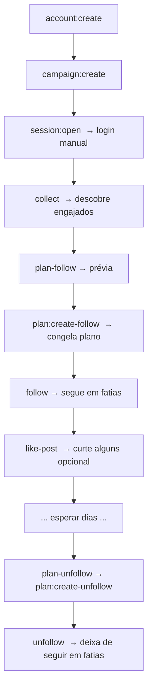

# TUTORIAL — automation-seguidores

Guia prático de **todos os comandos**. Cada comando traz: o que faz (em
linguagem simples), a **forma genérica** e um **exemplo real** de execução.

> **Como rodar:** todo comando é executado com o prefixo `npm run dev -- ` seguido
> do comando e suas opções. Ex.: `npm run dev -- config:show`.

---

## Índice

1. [Instalação e primeiros passos](#instalação-e-primeiros-passos)
2. [Conceitos essenciais](#conceitos-essenciais)
3. [Fluxo completo (a receita)](#fluxo-completo-a-receita)
4. [Preparação e diagnóstico](#1-preparação-e-diagnóstico)
5. [Conta e campanha](#2-conta-e-campanha)
6. [Sessão do navegador (login)](#3-sessão-do-navegador-login)
7. [Reconhecimento (somente leitura)](#4-reconhecimento-somente-leitura)
8. [Coleta de candidatos](#5-coleta-de-candidatos)
9. [Seguir (follow)](#6-seguir-follow)
10. [Curtir publicação](#7-curtir-publicação)
11. [Planos e execuções](#8-planos-e-execuções)
12. [Deixar de seguir (unfollow)](#9-deixar-de-seguir-unfollow)
13. [Reconciliação de follow-back (opcional)](#10-reconciliação-de-follow-back-opcional)
14. [Solução de problemas](#solução-de-problemas)
15. [Workflow end to end (exemplo: 100 follows)](#workflow-end-to-end)

---

## Instalação e primeiros passos

### Pré-requisitos
- **Node.js 20+** (testado no 24) e **npm**.
- Windows, macOS ou Linux.

### 1. Instalar dependências
Instala os pacotes e baixa o navegador (Chromium) que a ferramenta controla.

```bash
npm install
npx playwright install chromium
```

### 2. Criar o banco local
```bash
npm run dev -- db:migrate
```

### 3. Registrar sua conta e uma campanha
```bash
npm run dev -- account:create --username <sua_conta>
npm run dev -- campaign:create --name "Minha Campanha" --target <perfil_alvo>
```

### 4. Fazer login (uma vez)
Abre o Chrome visível. **Faça login na sua conta e feche a janela.** O login fica
salvo no perfil local (fora do OneDrive); você não precisa repetir a cada vez.

```bash
npm run dev -- session:open
```

### 5. Conferir que está tudo certo
```bash
npm run dev -- session:check --account <sua_conta>
npm run dev -- config:show
```

Pronto! A partir daqui, siga o [fluxo completo](#fluxo-completo-a-receita).

> **Dica:** quer experimentar sem tocar no Instagram? Rode
> `npm run dev -- fixtures:seed` para inserir dados fictícios e treinar os
> comandos de leitura.

---

## Conceitos essenciais

Antes de tudo, quatro ideias que valem para o app inteiro:

- **Padrão seguro:** por padrão nada acontece de verdade. O modo padrão é
  `dry-run` (só simula) e o limite real de ações é **zero**. Você precisa
  informar um modo real **e** um `--limit` positivo para qualquer ação acontecer.
- **Navegador visível + login manual:** a ferramenta abre um Chrome visível.
  Você faz login **você mesmo**; nenhuma senha é preenchida ou guardada.
- **Uma conta, uma ação por vez:** as ações rodam em sequência (não em paralelo).
  Isso é de propósito, para não queimar a conta.
- **Modos de execução** (para follow e unfollow):

  | Modo | O que faz |
  |---|---|
  | `dry-run` | Só lista o que **seria** feito. Nenhuma ação. (padrão) |
  | `manual` | Abre cada perfil e **espera você agir** manualmente. |
  | `confirm-each` | Pergunta **antes de cada** ação (você digita `s`/`n`). |
  | `supervised-batch` | **Uma** confirmação no início e depois executa o lote sozinho. |

  > `like-post` aceita `dry-run`, `manual` e `confirm-each` (sem lote).

---

## Fluxo completo (a receita)



Resumo em uma frase: **descobre gente engajada → segue → curte → espera → deixa
de seguir quem a ferramenta seguiu.**

---

## 1. Preparação e diagnóstico

### `config:show` — mostra a configuração efetiva
Mostra os padrões seguros aplicados (modo, limites, políticas).

```bash
# genérico
npm run dev -- config:show
# exemplo real
npm run dev -- config:show
```

**Saída (exemplo):**
```json
{
  "execution": { "mode": "dry-run", "visibleBrowser": true, "automaticActionsEnabled": false, "defaultRealActionLimit": 0 },
  "safety": { "stopOnWarning": true, "automaticResume": false, "parallelAccounts": false },
  "unfollow": { "onlyToolRecordedFollows": true, "preserveWhitelist": true, "preserveProtected": true, "preserveFollowBacks": false },
  "like": { "recentPostMaxAgeDays": 30, "maxLikesPerCandidatePerCampaign": 1 },
  "timezone": "America/Sao_Paulo"
}
```

### `paths:show` — onde ficam os dados
Mostra os caminhos do banco, perfil do navegador e evidências (tudo **fora** do
OneDrive).

```bash
npm run dev -- paths:show
```

### `safety:status` — estado das travas de segurança
Mostra o estado do monitor de segurança e as travas de configuração.

```bash
npm run dev -- safety:status
```

**Saída (exemplo):**
```json
{
  "state": "SAFE",
  "safe": true,
  "reason": null,
  "config": { "executionMode": "dry-run", "defaultRealActionLimit": 0, "automaticResume": false, "parallelAccounts": false }
}
```

### `db:migrate` / `db:status` — banco de dados
Cria/atualiza o banco e mostra o estado das migrações.

```bash
npm run dev -- db:migrate
npm run dev -- db:status
```

### `db:reset --confirm` — zera os dados (destrutivo)
Apaga os dados locais. Exige `--confirm`.

```bash
# genérico
npm run dev -- db:reset --confirm
# exemplo real (recomeçar um teste do zero)
npm run dev -- db:reset --confirm
```

---

## 2. Conta e campanha

### `account:create` — registra sua conta local
Registra o username da conta que você vai usar. **Não** guarda senha nem token —
serve só para a ferramenta saber qual conta é a sua e proteger contra troca de conta.

```bash
# genérico
npm run dev -- account:create --username <sua_conta>
# exemplo real
npm run dev -- account:create --username danielzp0
```

**Saída (exemplo):**
```json
{
  "ok": true,
  "created": true,
  "account": { "id": "506e7167-…", "username": "danielzp0", "sessionStatus": "unknown" }
}
```

### `campaign:create` — cria uma campanha com um alvo
Uma campanha aponta para **um perfil-alvo** (do seu nicho). É de lá que os
candidatos engajados serão descobertos.

```bash
# genérico
npm run dev -- campaign:create --name "<nome>" --target <perfil_alvo>
# exemplo real
npm run dev -- campaign:create --name "Teste" --target neto.invest
```

### `campaigns:list` — lista as campanhas
```bash
npm run dev -- campaigns:list
```

**Saída (exemplo):**
```json
{
  "campaigns": [
    { "id": "1f5f63b8-…", "name": "Teste", "targetUrl": "https://www.instagram.com/neto.invest/", "status": "ACTIVE" }
  ]
}
```

### `candidates:list` — lista os candidatos de uma campanha
Mostra as pessoas coletadas, com o engajamento.

```bash
# genérico
npm run dev -- candidates:list --campaign "<nome>"
# exemplo real
npm run dev -- candidates:list --campaign "Teste"
```

### `history` — histórico de uma pessoa
Mostra tudo que a ferramenta registrou sobre um username (ciclos e ações).

```bash
# genérico
npm run dev -- history --username <username>
# exemplo real
npm run dev -- history --username izaqueveloso
```

### `fixtures:seed` — dados de exemplo (sem Instagram)
Insere dados fictícios para você testar comandos sem tocar no Instagram.

```bash
npm run dev -- fixtures:seed
```

---

## 3. Sessão do navegador (login)

### `session:open` — abre o navegador para login
Abre o Chrome visível. **Faça login manualmente** e **feche a janela** quando
terminar. A sessão fica salva no perfil local (fora do OneDrive).

```bash
npm run dev -- session:open
```

### `session:check` — confere se está logado
Verifica (só leitura) se a sessão está autenticada e se a conta ativa bate com a
sua conta local.

```bash
# genérico
npm run dev -- session:check --account <sua_conta>
# exemplo real
npm run dev -- session:check --account danielzp0
```

### `session:clear --confirm` — apaga o login local
Remove o perfil do navegador (você terá que logar de novo). Exige `--confirm`.

```bash
npm run dev -- session:clear --confirm
```

---

## 4. Reconhecimento (somente leitura)

### `inspect-profile --url` — reconhece um perfil
Abre um perfil e diz se é público/privado, se você segue, quantas publicações
tem, etc. **Não clica em nada.**

```bash
# genérico
npm run dev -- inspect-profile --url https://www.instagram.com/<perfil>/
# exemplo real
npm run dev -- inspect-profile --url https://www.instagram.com/neto.invest/
```

### `debug:capture --url` — captura o DOM (para calibrar seletores)
Salva o HTML e um screenshot de uma página. Útil quando o layout do Instagram
muda e algum seletor precisa de ajuste.

```bash
# genérico
npm run dev -- debug:capture --url https://www.instagram.com/<perfil>/
# abrir o diálogo de "Following" antes de capturar (para calibrar o unfollow)
npm run dev -- debug:capture --url https://www.instagram.com/<perfil>/ --open-following-menu
# exemplo real
npm run dev -- debug:capture --url https://www.instagram.com/sigaodavid/
```

---

## 5. Coleta de candidatos

### `collect` — descobre gente engajada
Abre as publicações recentes do perfil-alvo, **rola os comentários** e coleta
quem comentou (e, opcionalmente, quem curtiu). Prioriza **comentaristas** porque
são mais engajados. Somente leitura.

- `--limit` (padrão 30): máximo de candidatos únicos.
- `--posts` (padrão 6): quantas publicações recentes abrir.
- `--skip-posts` (padrão 0): pula os primeiros N posts do grid. Útil quando o
  perfil tem **post(s) fixado(s)** no topo — assim a re-execução pega publicações
  mais novas em vez de repetir sempre o mesmo post fixado.
- `--likers`: também tenta curtidores (o Instagram costuma esconder).

```bash
# genérico
npm run dev -- collect --campaign "<nome>" --posts <n> --limit <n>
# exemplo real
npm run dev -- collect --campaign "Teste" --posts 6 --limit 300
# pulando 3 posts fixados no topo do grid
npm run dev -- collect --campaign "Teste" --posts 6 --limit 300 --skip-posts 3
```

**Saída (exemplo):**
```json
{
  "ok": true,
  "campaign": "Teste",
  "postsVisited": 6,
  "input": 92,
  "uniqueUsernames": 83,
  "candidatesCreated": 83,
  "signalsRecorded": 92
}
```
> `uniqueUsernames` são os candidatos distintos encontrados; `signalsRecorded`
> conta os sinais de engajamento (um comentário/curtida por publicação).

---

## 6. Seguir (follow)

O follow acontece em duas etapas: **congelar um plano** e depois **executá-lo**
em fatias.

### `plan-follow` — prévia (dry-run), não segue ninguém
Mostra, ordenados por engajamento, quem seria seguido. Exclui quem você já segue.

```bash
# genérico
npm run dev -- plan-follow --campaign "<nome>"
# exemplo real
npm run dev -- plan-follow --campaign "Teste"
```

**Saída (exemplo):**
```json
{
  "campaign": "Teste",
  "account": "danielzp0",
  "dryRun": true,
  "preview": {
    "totalCollected": 83,
    "totalApproved": 81,
    "totalProposed": 81,
    "excluded": { "whitelisted": 0, "protected": 0, "already_following": 2 },
    "proposed": [ { "username": "sigaodavid", "score": 3 } ]
  }
}
```
> `already_following: 2` = duas pessoas já são seguidas e foram excluídas.

### `plan:create-follow` — congela um plano imutável
Cria um plano fixo (FROZEN) com os candidatos. É esse plano que você executa
depois, em fatias, ao longo dos dias.

- `--limit`: limita quantos itens entram no plano.

```bash
# genérico
npm run dev -- plan:create-follow --campaign "<nome>" --limit <n>
# exemplo real
npm run dev -- plan:create-follow --campaign "Teste" --limit 10
```

**Saída (exemplo):** guarde o `planId` — você vai usá-lo no `follow`.
```json
{
  "ok": true,
  "planId": "a7d32aec-0852-453d-aeae-922cb30f2371",
  "state": "FROZEN",
  "itemCount": 10,
  "criteriaHash": "802696c6…"
}
```

### `follow` — segue de verdade (supervisionado)
Executa o plano. **Padrão é dry-run**; para agir de verdade, informe `--plan`,
um `--mode` real e um `--limit` positivo.

- `--plan <id>`: o plano congelado (obrigatório fora do dry-run).
- `--mode`: `dry-run` | `manual` | `confirm-each` | `supervised-batch`.
- `--limit` (padrão 0): teto de **ações reais** (quem já é seguido é pulado sem
  gastar o limite).
- `--skip-inactive <n>`: **filtro de qualidade** — pula perfis com **menos de N
  seguidores E menos de N seguindo** (contas vazias/bot). Ex.: `--skip-inactive 20`
  ignora quem tem menos de 20 seguidores e menos de 20 seguindo. Se algum contador
  não puder ser lido, o perfil **não** é pulado (segue normalmente).
- `--like`: ao seguir um perfil **ABERTO**, também curte **1 publicação recente**
  na mesma passada (uma por pessoa por campanha). Perfis **fechados** viram
  solicitação e **não** são curtidos (você nem vê os posts). No progresso aparece
  uma linha `↳ like @fulano: LIKED`. O total curtido vem em `liked` na saída.

```bash
# genérico
npm run dev -- follow --plan <id> --mode <modo> --limit <n>
# exemplo real (segue 3 automaticamente, com 1 confirmação inicial)
npm run dev -- follow --plan a7d32aec-0852-453d-aeae-922cb30f2371 --mode supervised-batch --limit 3
# pulando perfis inativos (menos de 20 seguidores E menos de 20 seguindo)
npm run dev -- follow --plan <id> --mode supervised-batch --limit 20 --skip-inactive 20
# seguir E curtir 1 post dos perfis abertos, pulando inativos
npm run dev -- follow --plan <id> --mode supervised-batch --limit 20 --skip-inactive 20 --like
```

**Saída (exemplo):**
```json
{
  "mode": "supervised-batch",
  "proposed": 10,
  "processed": 5,
  "proceeded": 3,
  "confirmed": 3,
  "skipped": 2,
  "ambiguous": 0,
  "failed": 0,
  "stopped": true,
  "stopReason": "limite de ações reais atingido"
}
```
> Aqui `confirmed: 3` são os follows novos; `skipped: 2` são os que já eram
> seguidos (não gastam o limite).

> **Escala:** para muitos usuários, crie **um** plano grande e execute
> `--limit` pequeno **por dia** (ex.: 30/dia). A idempotência pula quem já foi
> seguido, então é só repetir o mesmo comando nos dias seguintes.

---

## 7. Curtir publicação

### `like-post` — curte 1 publicação recente por candidato
Para cada candidato: abre o perfil, escolhe a publicação recente, abre e curte.
No modo `confirm-each` você decide **curtir ou pular** a cada um — assim não sai
curtindo tudo. No máximo **uma** curtida por pessoa por campanha.

- `--campaign` ou `--username` (um só alvo).
- `--mode`: `dry-run` | `manual` | `confirm-each`.
- `--limit` (padrão 0): teto de curtidas reais.

```bash
# genérico
npm run dev -- like-post --campaign "<nome>" --mode <modo> --limit <n>
# exemplo real (pergunta a cada um; curte no máximo 3)
npm run dev -- like-post --campaign "Teste" --mode confirm-each --limit 3
# curtir só uma pessoa específica
npm run dev -- like-post --username filmcultbr --mode confirm-each --limit 1
```

No terminal, para cada candidato aparece: `Curtir a publicação <url> de @user? [s/N]`

**Saída (exemplo):**
```json
{
  "mode": "confirm-each",
  "proposed": 83,
  "confirmed": 1,
  "skipped": 0,
  "ambiguous": 0,
  "failed": 0,
  "stopped": true,
  "stopReason": "limite de ações reais atingido"
}
```

---

## 8. Planos e execuções

### `plans:list` — lista os planos
```bash
npm run dev -- plans:list
```

### `plans:show --plan` — mostra um plano e seus itens
```bash
# genérico
npm run dev -- plans:show --plan <id>
# exemplo real
npm run dev -- plans:show --plan a7d32aec-0852-453d-aeae-922cb30f2371
```

### `runs:list` / `runs:show --run` — execuções registradas
```bash
npm run dev -- runs:list
npm run dev -- runs:show --run <id>
```

---

## 9. Deixar de seguir (unfollow)

Mesma ideia do follow: **planeja** e depois **executa** em fatias. A ferramenta
só deixa de seguir quem **ela mesma** seguiu (`origin = TOOL_CLICK`). Quem você
seguiu manualmente, fora da ferramenta, **nunca** entra.

> **Deixar de seguir TUDO que a ferramenta seguiu (qualquer campanha):** basta
> rodar `plan-unfollow` **sem** `--campaign` e **sem** filtro de período. Isso
> considera todos os ciclos `TOOL_CLICK` abertos da conta, de qualquer campanha
> (inclusive follows sem campanha). Whitelist e protegidos continuam de fora.

### `plan-unfollow` — prévia (dry-run) por período
Mostra quem seria removido, com filtros de período. Sem filtro, considera todos
os follows que a ferramenta fez.

- `--older-than <dias>`: seguidos há mais de N dias.
- `--followed-within <dias>`: seguidos nos últimos N dias.
- `--from <YYYY-MM-DD>` / `--to <YYYY-MM-DD>`: intervalo de datas.
- `--calendar-month <YYYY-MM>`: um mês de calendário.
- `--campaign "<nome>"`: restringe a uma campanha. **Omita** para pegar todas.
- `--exclude-followers`: não remover quem seguiu de volta.
- `--limit <n>`, `--export csv|json`.

```bash
# TUDO que a ferramenta seguiu, de QUALQUER campanha (sem filtro)
npm run dev -- plan-unfollow
# restrito a uma campanha
npm run dev -- plan-unfollow --campaign "Teste"
# só quem foi seguido há mais de 7 dias (qualquer campanha)
npm run dev -- plan-unfollow --older-than 7
```

**Saída (exemplo):**
```json
{
  "account": "danielzp0",
  "dryRun": true,
  "window": "sem janela (todos os follows da ferramenta)",
  "preview": {
    "totalFound": 2,
    "totalEligible": 2,
    "totalProposed": 2,
    "excluded": { "no_tool_history": 0, "whitelisted": 0, "protected": 0, "follower": 0, "follow_back_not_no": 0 },
    "proposed": [ { "username": "alexfernandesprestes" } ]
  }
}
```

### `plan:create-unfollow` — congela o plano de unfollow
```bash
# congela TUDO que a ferramenta seguiu, qualquer campanha (sem filtro)
npm run dev -- plan:create-unfollow
# restrito a uma campanha
npm run dev -- plan:create-unfollow --campaign "Teste"
# só quem foi seguido há mais de N dias
npm run dev -- plan:create-unfollow --older-than 7
```

### `unfollow` — deixa de seguir de verdade (supervisionado)
Executa o plano de unfollow. Revalida cada item ao vivo. Se você já tiver deixado
de seguir manualmente, ele **sincroniza sem clicar**. Uma solicitação pendente é
**cancelada** (não é "unfollow").

- `--plan <id>` (obrigatório).
- `--mode`: `dry-run` | `manual` | `confirm-each` | `supervised-batch`.
- `--limit` (padrão 0): teto de ações reais.

```bash
# genérico
npm run dev -- unfollow --plan <id> --mode <modo> --limit <n>
# exemplo real (deixa de seguir 1, pedindo confirmação)
npm run dev -- unfollow --plan 1657c7b4-b683-4acb-b41c-9b921067d257 --mode confirm-each --limit 1
```

**Saída (exemplo):**
```json
{
  "mode": "confirm-each",
  "proposed": 3,
  "synced": 0,
  "processed": 1,
  "proceeded": 1,
  "confirmed": 1,
  "ambiguous": 0,
  "failed": 0,
  "stopped": true,
  "stopReason": "limite de ações reais atingido"
}
```
> `synced` conta quem você já tinha deixado de seguir manualmente (fechado sem clicar).

> Depois de desseguir, a pessoa **não volta** para a lista (o ciclo é fechado).
> Ela só voltaria se você **seguir de novo** pela ferramenta.

---

## 10. Reconciliação de follow-back (opcional)

### `reconcile-followback` — observa quem seguiu de volta
Somente leitura: registra `YES`/`NO`/`UNKNOWN` de follow-back nos ciclos.

> **Observação:** com a política atual (não preservar follow-backs), este passo
> é **opcional** — o unfollow remove todos os follows da ferramenta de qualquer
> forma. Use só se quiser registrar quem retribuiu, para análise.

- `--campaign`, `--account`, `--limit` (padrão 25), `--dry-run`.

```bash
# genérico
npm run dev -- reconcile-followback --campaign "<nome>" --limit <n>
# exemplo real (só lista o que seria verificado)
npm run dev -- reconcile-followback --campaign "Teste" --dry-run
```

**Saída (exemplo):** (execução real, sem `--dry-run`)
```json
{ "processed": 3, "yes": 0, "no": 3, "unknown": 0, "stopped": false, "stopReason": null }
```

---

## Solução de problemas

Mensagens comuns na saída e o que fazer. Lembre: parar é **proposital** — a
ferramenta falha "fechada" (na dúvida, não age).

### Sessão e conta

- **`sessão não autenticada; use session:open`**
  Você não está logado. Rode `npm run dev -- session:open`, faça login e feche a
  janela. Confirme com `session:check`.

- **`safetyState: UNKNOWN_INTERFACE` / `sessão não segura`**
  A ferramenta não reconheceu a página. Quase sempre é **falta de login** ou uma
  tela inesperada. Rode `session:check`; se estiver deslogado, `session:open`.

- **`conta ativa divergente` / `ACCOUNT_CHANGED`**
  O navegador está logado numa conta diferente da informada em `--account`.
  Entre na conta certa (via `session:open`) ou ajuste o `--account`.

### Durante as ações (follow/like/unfollow)

- **`limite de ações reais atingido`**
  Normal — você atingiu o `--limit`. É o comportamento esperado das fatias.

- **`resultado ambíguo; revisão manual necessária`**
  A ferramenta clicou mas **não conseguiu confirmar** visualmente o resultado.
  O lote para por segurança. Verifique manualmente no navegador se a ação
  aconteceu. Para reprocessar os demais, **crie um plano novo** (veja abaixo).

- **`ação anterior não confirmada; reconcilie antes de prosseguir`**
  Existe uma tentativa anterior **ambígua/pendente** para aquele item, que
  bloqueia repetir o **mesmo** plano. Solução: gere um **plano novo**
  (`plan:create-follow` / `plan:create-unfollow`) — os itens ganham IDs novos e
  o que já foi feito é pulado na inspeção ao vivo.

- **`WARNING_DETECTED` / `CHALLENGE_DETECTED` / `CAPTCHA_DETECTED`**
  O Instagram sinalizou a conta (aviso, desafio ou CAPTCHA). A ferramenta **para
  imediatamente**. Abra o navegador, resolva manualmente, **espere** (horas/um
  dia) e reduza o ritmo diário. Não force.

### Planos e cadastros

- **`O plano informado não está congelado (FROZEN)`**
  Fora do dry-run, o follow/unfollow exige um plano congelado. Rode
  `plan:create-follow` (ou `plan:create-unfollow`) e use o `planId` retornado.

- **`Plano não encontrado` / `Campanha não encontrada`**
  Confira o id/nome. Liste com `plans:list` ou `campaigns:list`.

- **`Nenhuma conta local`**
  Rode `npm run dev -- account:create --username <sua_conta>` primeiro.

### Instalação

- **Erro do Playwright / navegador não instalado**
  Rode `npx playwright install chromium`.

- **Erro de módulo nativo (`better-sqlite3`)**
  Rode `npm install` de novo (ele recompila o módulo para a sua versão do Node).

---

## Workflow end to end

Exemplo completo de ponta a ponta: **seguir 100 pessoas e depois deixar de
seguir**, tudo supervisionado e em fatias. Ajuste os números ao seu caso — o
`--limit` é um teto contra excesso acidental, **não** uma garantia de segurança
perante o Instagram.

> Antes de começar: assuma o risco de ações reais na sua conta. Todos os
> comandos usam o prefixo `npm run dev -- `.

### 1. Registrar a conta e a campanha (com o perfil-alvo)
```bash
# sua conta local (sem senha/token)
npm run dev -- account:create --username <sua_conta>
# campanha apontando para o PERFIL-ALVO do seu nicho (de onde saem os candidatos)
npm run dev -- campaign:create --name "Teste" --target <perfil_alvo>
```
> O `--target` é o perfil da pessoa/negócio cujo público engajado você quer
> alcançar. É de lá que a coleta tira os candidatos.

### 2. Fazer login (uma vez) e conferir a sessão
```bash
npm run dev -- session:open                        # abre o Chrome: FAÇA LOGIN e feche a janela
npm run dev -- session:check --account <sua_conta> # deve mostrar authenticated + conta certa
```

### 3. Coletar candidatos (>= 100)
```bash
npm run dev -- collect --campaign "Teste" --posts 8 --limit 300 --skip-posts 0
npm run dev -- plan-follow --campaign "Teste"
```
Olhe `preview.totalProposed` na saída do `plan-follow`. **Só avance quando for
≥ 100.** Se faltar, rode `collect` de novo com mais `--posts` (ou aponte a
campanha para outro perfil-alvo e colete de novo).

> `--skip-posts 0` (padrão) não pula nada. Se o alvo tiver **post(s) fixado(s)**
> no topo, use `--skip-posts 3` para pular os fixados e coletar de publicações
> mais novas (evita repetir sempre a mesma galera a cada re-execução).

### 4. Congelar o plano de follow (100 itens)
```bash
npm run dev -- plan:create-follow --campaign "Teste" --limit 100
```
Copie o `planId` da saída — aqui chamado de `<PLANO_FOLLOW>`.

### 5. Seguir os 100 de uma vez
```bash
npm run dev -- follow --plan <PLANO_FOLLOW> --mode supervised-batch --limit 100
```
- `supervised-batch` pede **1 confirmação** no início e depois segue os 100 em
  sequência, sozinho, no navegador visível.
- **Parada fechada:** se um item der `resultado ambíguo`/falha, o lote para ali;
  rode o **mesmo** comando de novo para terminar os restantes (os já feitos são
  pulados por idempotência).
- Um lote grande de uma vez aumenta o risco de bloqueio de ação — o `--limit` é
  teto contra excesso acidental, não garantia de segurança. Se preferir ir aos
  poucos, use um `--limit` menor (ex.: 20) e rode mais vezes, ou `--mode confirm-each`.
- **Extras opcionais:** `--skip-inactive 20` ignora contas vazias/bot e `--like`
  curte 1 post dos perfis abertos na mesma passada:
  ```bash
  npm run dev -- follow --plan <PLANO_FOLLOW> --mode supervised-batch --limit 100 --skip-inactive 20 --like
  ```

### 6. Esperar
O intervalo até desseguir é decisão sua.

### 7. Planejar o unfollow **desta campanha**
```bash
# remove apenas os follows DESTA campanha (a que você acabou de rodar)
npm run dev -- plan-unfollow --campaign "Teste"
npm run dev -- plan:create-unfollow --campaign "Teste"
```
Copie o `planId` — aqui `<PLANO_UNFOLLOW>`.

> Para desseguir **tudo** que a ferramenta seguiu (qualquer campanha), **omita**
> o `--campaign` nos dois comandos. Whitelist e protegidos nunca entram.

### 8. Deixar de seguir os 100 de uma vez
```bash
npm run dev -- unfollow --plan <PLANO_UNFOLLOW> --mode supervised-batch --limit 100
```
Mesma lógica do follow: 1 confirmação e roda tudo; se parar em algum item, rode
de novo o **mesmo** plano para concluir. Perfis com **solicitação pendente** têm
o pedido **cancelado** (não é "unfollow"); quem você já desseguiu manualmente é
**sincronizado sem clicar**.

### 9. Conferir o resultado
```bash
npm run dev -- runs:report      # relatório human-readable da última execução
npm run dev -- metrics          # visão agregada (coleta, ações, follows por campanha)
```

> **Retomada:** não existe retomada automática — se o lote parar no meio
> (ambiguidade/falha), reexecutar o **mesmo plano** conclui o restante. Toda
> execução exige `--limit` positivo e roda no navegador visível, em sequência.

> **Recomeçar do zero:** para zerar todo o histórico local e testar de novo,
> use `npm run dev -- db:reset --confirm` (destrutivo) e depois `db:migrate`
> (ver seção 1).

---

## Aviso importante

A automação por interface está sujeita a **mudanças de layout** e às **regras do
Instagram**. Os limites configuráveis evitam excesso acidental, mas **não
garantem** segurança perante a plataforma. Use apenas em contas próprias ou
autorizadas, comece devagar (ex.: 20–30 ações/dia numa conta nova) e aumente aos
poucos.
